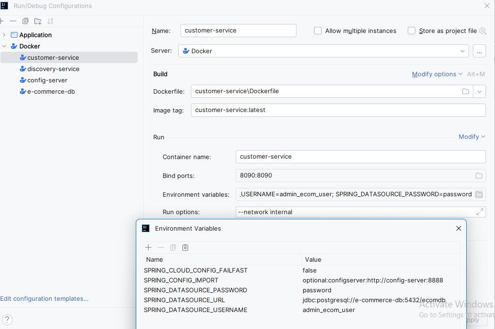

from Config-server each service properties can be viewed as

http://localhost:8888/actuator/health
http://localhost:8888/discovery-service/default
http://localhost:8888/customer-service/default

for every service having ENV varibales for docker compose fixed most issues

SPRING_CLOUD_CONFIG_FAILFAST=false;
SPRING_CONFIG_IMPORT=optional:configserver:http://config-server:8888;
SPRING_DATASOURCE_PASSWORD=password;
SPRING_DATASOURCE_URL=jdbc:postgresql://e-commerce-db:5432/ecomdb;
SPRING_DATASOURCE_USERNAME=admin_ecom_user

Set RunOptions to set --network internal
for example customer-service - docker composed via IntelliJ IDEA

